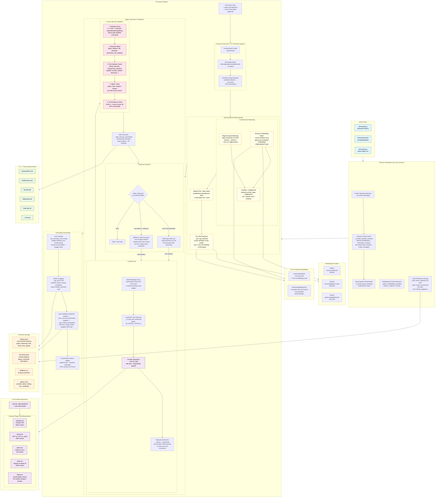
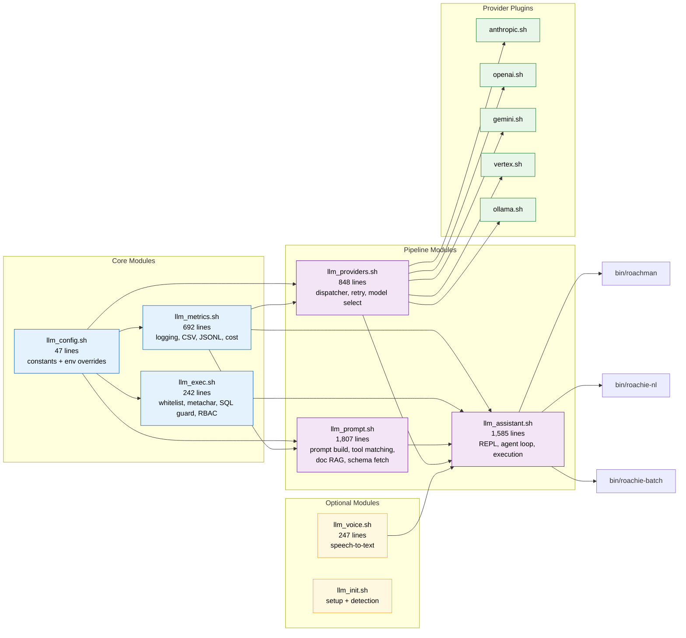
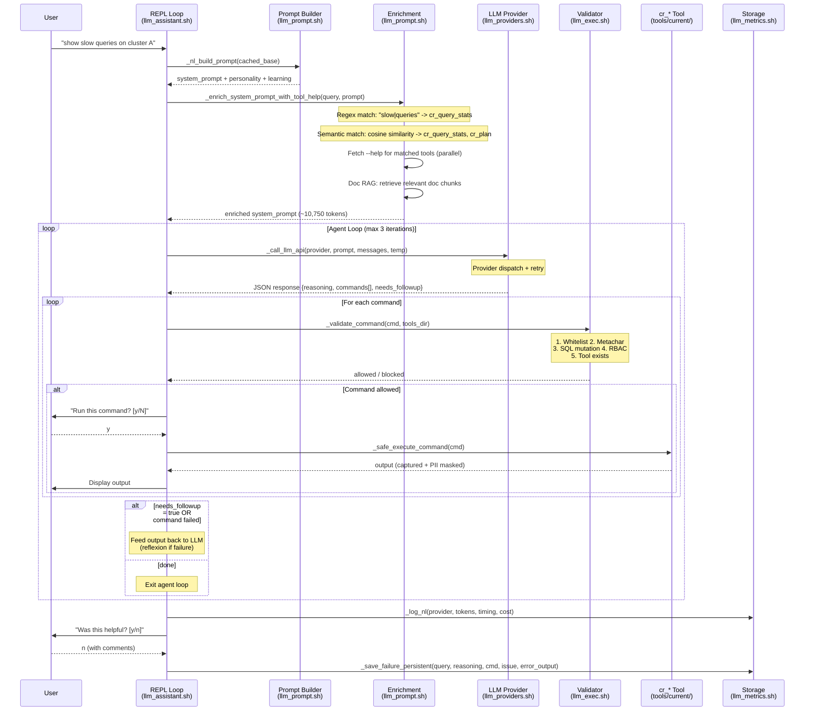
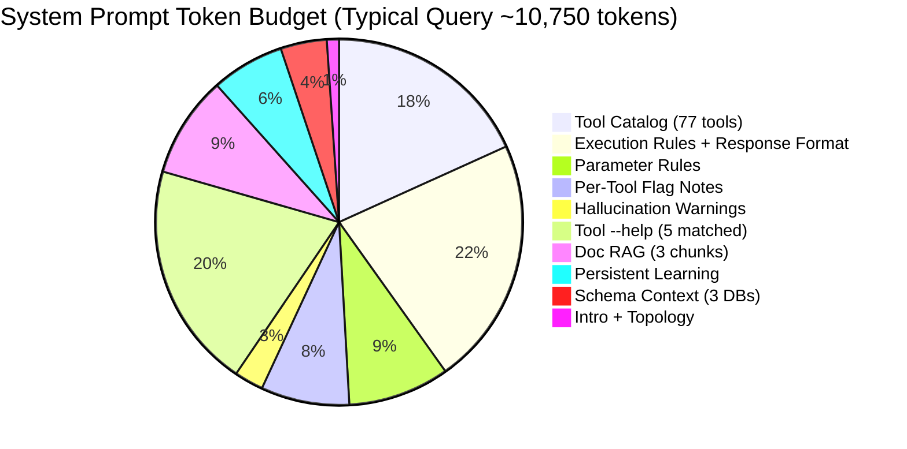
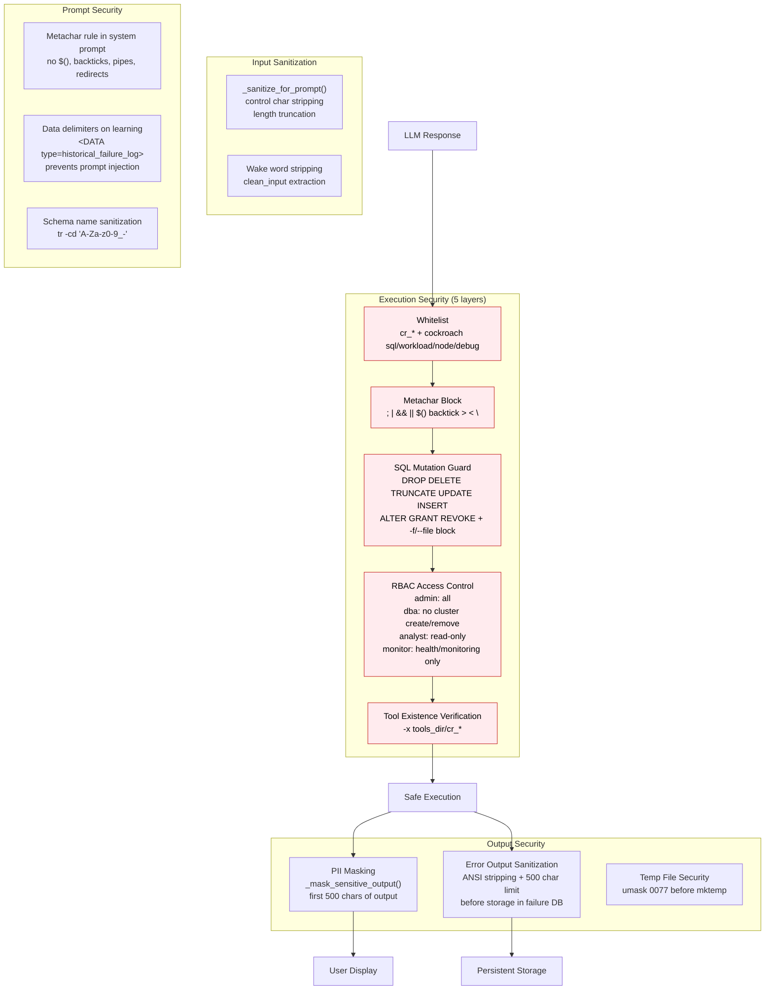

# Roachie AI Architecture Diagram — 2026-03-18

## Full NL Pipeline Architecture

## Module Dependency Graph

## Data Flow: Query to Command Execution

## Token Budget Composition

## Security Architecture

## File Reference

| Module | Lines | Role in Pipeline |
|--------|------:|------------------|
| `llm_config.sh` | 47 | Constants with env var overrides |
| `llm_init.sh` | ~150 | Provider/model setup, first-run detection |
| `llm_prompt.sh` | 1,807 | Prompt construction, tool matching (regex+semantic), doc RAG, schema fetch |
| `llm_providers.sh` | 848 | Provider dispatch, retry, model selection, native tool call conversion |
| `llm_assistant.sh` | 1,585 | REPL loop, agent loop, command execution, feedback, cost tracking |
| `llm_exec.sh` | 242 | Whitelist, metachar, SQL mutation, RBAC validation |
| `llm_metrics.sh` | 692 | CSV/JSONL logging, cost calculation, persistent failure/success DBs |
| `llm_voice.sh` | 247 | Speech-to-text transcription |
| `providers/anthropic.sh` | ~200 | Anthropic Claude API (streaming + non-streaming) |
| `providers/openai.sh` | ~250 | OpenAI GPT/o-series API (streaming, tool calling) |
| `providers/gemini.sh` | ~350 | Google Gemini API (thinking budget, tool calling) |
| `providers/vertex.sh` | ~200 | Vertex AI Claude (gcloud auth) |
| `providers/ollama.sh` | ~250 | Local Ollama models (compact prompt path) |
| **Total** | **~6,650** | |

---

*Diagrams rendered with Mermaid. View in any Mermaid-compatible renderer (GitHub, VS Code, mermaid.live).*
