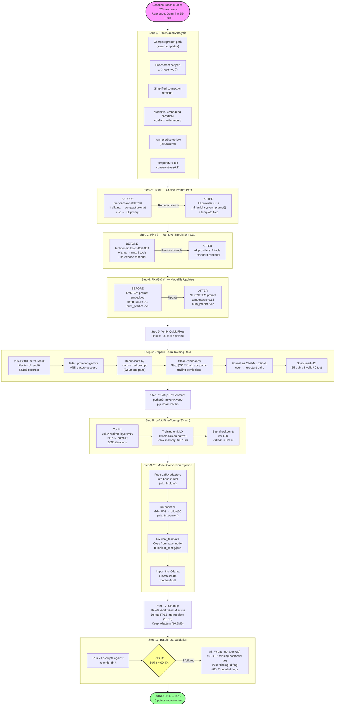
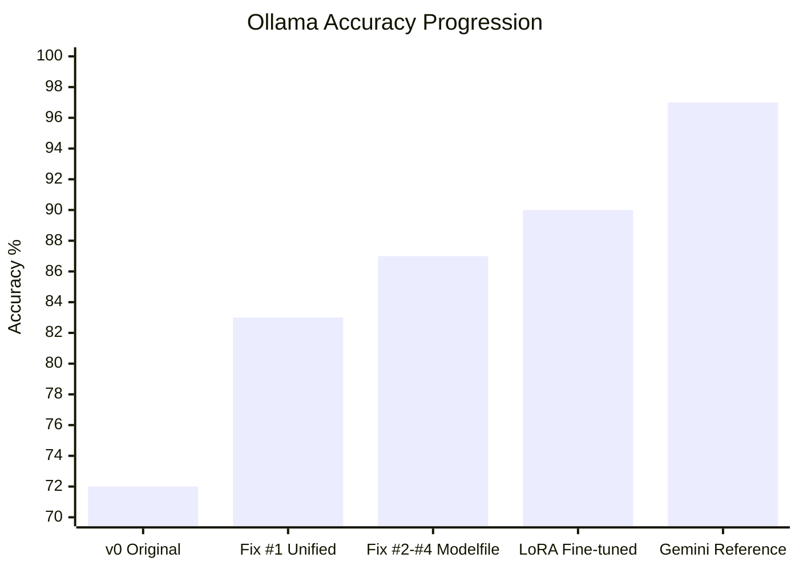
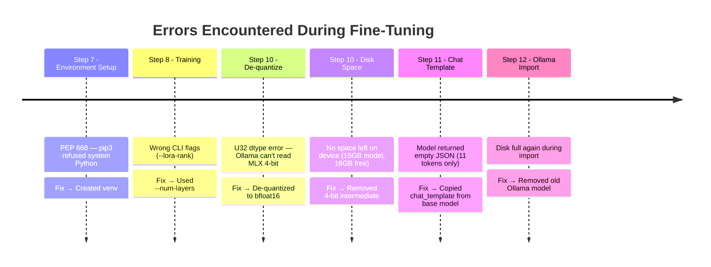
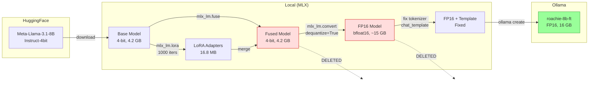
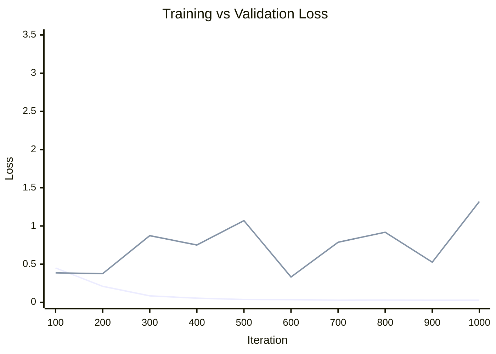

# Process Flow: Llama 8B Accuracy Improvement (82% → 90%) — Mermaid

## Master Process Flow

```mermaid
flowchart TD
    START([" Baseline: roachie-8b at 82% accuracy<br/>Reference: Gemini at 95-100%"]) --> RCA

    subgraph RCA["Step 1: Root Cause Analysis"]
        RCA1["Compact prompt path<br/>(fewer templates)"]
        RCA2["Enrichment capped<br/>at 3 tools (vs 7)"]
        RCA3["Simplified connection<br/>reminder"]
        RCA4["Modelfile: embedded SYSTEM<br/>conflicts with runtime"]
        RCA5["num_predict too low<br/>(256 tokens)"]
        RCA6["temperature too<br/>conservative (0.1)"]
    end

    RCA --> FIX1

    subgraph FIX1["Step 2: Fix #1 — Unified Prompt Path"]
        direction LR
        F1_BEFORE["BEFORE<br/>bin/roachie-batch:639<br/>if ollama → compact prompt<br/>else → full prompt"] -->|"Remove branch"| F1_AFTER["AFTER<br/>All providers use<br/>_nl_build_system_prompt()<br/>7 template files"]
    end

    FIX1 --> FIX2

    subgraph FIX2["Step 3: Fix #2 — Remove Enrichment Cap"]
        direction LR
        F2_BEFORE["BEFORE<br/>bin/roachie-batch:831-839<br/>ollama → max 3 tools<br/>+ hardcoded reminder"] -->|"Remove branch"| F2_AFTER["AFTER<br/>All providers: 7 tools<br/>+ standard reminder"]
    end

    FIX2 --> FIX3

    subgraph FIX3["Step 4: Fix #3 & #4 — Modelfile Updates"]
        direction LR
        F3_BEFORE["BEFORE<br/>SYSTEM prompt embedded<br/>temperature 0.1<br/>num_predict 256"] -->|"Update"| F3_AFTER["AFTER<br/>No SYSTEM prompt<br/>temperature 0.15<br/>num_predict 512"]
    end

    FIX3 --> VERIFY["Step 5: Verify Quick Fixes<br/>Result: ~87% (+5 points)"]

    VERIFY --> PREP

    subgraph PREP["Step 6: Prepare LoRA Training Data"]
        P1["156 JSONL batch result<br/>files in sql_audit/<br/>(3,105 records)"] --> P2["Filter: provider=gemini<br/>AND status=success"]
        P2 --> P3["Deduplicate by<br/>normalized prompt<br/>(82 unique pairs)"]
        P3 --> P4["Clean commands<br/>Strip [OK:XXms], abs paths,<br/>trailing semicolons"]
        P4 --> P5["Format as Chat-ML JSONL<br/>user → assistant pairs"]
        P5 --> P6["Split (seed=42)<br/>65 train / 8 valid / 9 test"]
    end

    PREP --> ENV["Step 7: Setup Environment<br/>python3 -m venv .venv<br/>pip install mlx-lm"]

    ENV --> TRAIN

    subgraph TRAIN["Step 8: LoRA Fine-Tuning (33 min)"]
        T1["Config:<br/>LoRA rank=8, layers=16<br/>lr=1e-5, batch=1<br/>1000 iterations"] --> T2["Training on MLX<br/>(Apple Silicon native)<br/>Peak memory: 6.87 GB"]
        T2 --> T3["Best checkpoint:<br/>iter 600<br/>val loss = 0.332"]
    end

    TRAIN --> FUSE

    subgraph FUSE["Step 9-11: Model Conversion Pipeline"]
        direction TB
        M1["Fuse LoRA adapters<br/>into base model<br/>(mlx_lm.fuse)"] --> M2["De-quantize<br/>4-bit U32 → bfloat16<br/>(mlx_lm.convert)"]
        M2 --> M3["Fix chat_template<br/>Copy from base model<br/>tokenizer_config.json"]
        M3 --> M4["Import into Ollama<br/>ollama create<br/>roachie-8b-ft"]
    end

    FUSE --> CLEAN["Step 12: Cleanup<br/>Delete 4-bit fused (4.2GB)<br/>Delete FP16 intermediate (15GB)<br/>Keep adapters (16.8MB)"]

    CLEAN --> TEST

    subgraph TEST["Step 13: Batch Test Validation"]
        V1["Run 73 prompts against<br/>roachie-8b-ft"] --> V2{"Result:<br/>66/73 = 90.4%"}
        V2 -->|"5 failures"| V3["#8: Wrong tool (backup)<br/>#57,#70: Missing positional arg<br/>#61: Missing -d flag<br/>#68: Truncated flags"]
    end

    TEST --> DONE(["DONE: 82% → 90%<br/>+8 points improvement"])

    style START fill:#f9f,stroke:#333,stroke-width:2px
    style DONE fill:#9f9,stroke:#333,stroke-width:2px
    style V2 fill:#ff9,stroke:#333,stroke-width:2px
```

## Accuracy Progression

```mermaid
xychart-beta
    title "Ollama Accuracy Progression"
    x-axis ["v0 Original", "Fix #1 Unified", "Fix #2-#4 Modelfile", "LoRA Fine-tuned", "Gemini Reference"]
    y-axis "Accuracy %" 70 --> 100
    bar [72, 83, 87, 90, 97]
```

## Error Timeline

```mermaid
timeline
    title Errors Encountered During Fine-Tuning
    Step 7 - Environment Setup
        : PEP 668 — pip3 refused system Python
        : Fix → Created venv
    Step 8 - Training
        : Wrong CLI flags (--lora-rank)
        : Fix → Used --num-layers
    Step 10 - De-quantize
        : U32 dtype error — Ollama can't read MLX 4-bit
        : Fix → De-quantized to bfloat16
    Step 10 - Disk Space
        : No space left on device (15GB model, 16GB free)
        : Fix → Removed 4-bit intermediate
    Step 11 - Chat Template
        : Model returned empty JSON (11 tokens only)
        : Fix → Copied chat_template from base model
    Step 12 - Ollama Import
        : Disk full again during import
        : Fix → Removed old Ollama model
```

## Model Conversion Pipeline

```mermaid
flowchart LR
    subgraph HuggingFace
        HF["Meta-Llama-3.1-8B<br/>Instruct-4bit"]
    end

    subgraph "Local (MLX)"
        BASE["Base Model<br/>4-bit, 4.2 GB"] -->|"mlx_lm.lora<br/>1000 iters"| ADAPT["LoRA Adapters<br/>16.8 MB"]
        BASE -->|"mlx_lm.fuse"| FUSED["Fused Model<br/>4-bit, 4.2 GB"]
        ADAPT -->|"merge"| FUSED
        FUSED -->|"mlx_lm.convert<br/>dequantize=True"| FP16["FP16 Model<br/>bfloat16, ~15 GB"]
        FP16 -->|"fix tokenizer<br/>chat_template"| FP16FIX["FP16 + Template<br/>Fixed"]
    end

    subgraph Ollama
        MODEL["roachie-8b-ft<br/>FP16, 16 GB"]
    end

    HF -->|"download"| BASE
    FP16FIX -->|"ollama create"| MODEL

    FUSED -.->|"DELETED"| X1[" "]
    FP16 -.->|"DELETED"| X2[" "]

    style X1 fill:none,stroke:none
    style X2 fill:none,stroke:none
    style FUSED fill:#fdd,stroke:#c00
    style FP16 fill:#fdd,stroke:#c00
    style MODEL fill:#9f9,stroke:#393
```

## Loss Curve

```mermaid
xychart-beta
    title "Training vs Validation Loss"
    x-axis "Iteration" [100, 200, 300, 400, 500, 600, 700, 800, 900, 1000]
    y-axis "Loss" 0 --> 3.5
    line "Train Loss" [0.450, 0.210, 0.085, 0.055, 0.038, 0.035, 0.029, 0.030, 0.028, 0.029]
    line "Val Loss" [0.386, 0.376, 0.873, 0.751, 1.070, 0.332, 0.787, 0.918, 0.526, 1.320]
```
